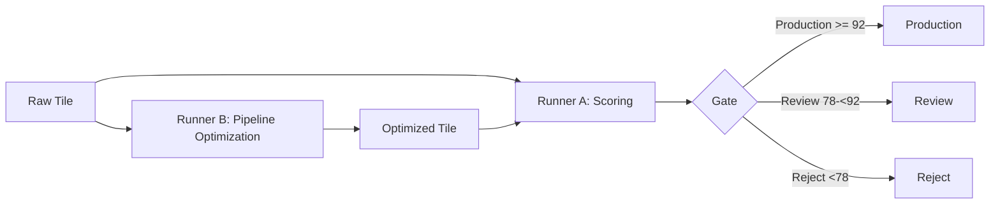

# TileSmith GC-Pipeline Benchmark

[](https://creativecommons.org/licenses/by-sa/4.0/) [](https://creativecommons.org/publicdomain/zero/1.0/) [](docs/QUALITY_SCORING.md) [](https://github.com/Kleeblatt-space/gc-pipeline-benchmark/actions/workflows/run-benchmark-ci.yml)

> **Reproduzierbare, automatisierte Qualitätskontrolle für Game-Ready-Tiles.** Dieses Repository enthält das öffentliche Benchmark-Framework, synthetische Ground-Truth-Daten, Optimierungs-Runner und die technische Telemetrie-Spezifikation von TileSmith.

## Problem

Visuell überzeugende, generierte Texturen können in Game-Engines an technischen Details scheitern: an 1-Pixel-Rändern, sichtbaren Wasserzeichen, regelmäßigen Musterwiederholungen, gebrochenen Nähten oder zu geringer Fidelity. Der Benchmark macht diese Fehler messbar und schafft einen nachvollziehbaren Standard für die technische Prüfung.

## Lösung: Dual-Optimization Architecture

TileSmith trennt die Qualitätsmessung von der aktiven Verbesserung. Beide Prozesse können iterativ zusammengeführt werden, ohne die öffentliche Ground Truth oder proprietäre Tuning-Parameter zu vermischen.



**Runner A** bewertet sechs Metriken: Seam, Border, Artifact, Pattern, Fidelity und Textile. **Runner B** optimiert Pipeline-Parameter und die Schritt-Reihenfolge, wobei harte Abhängigkeiten und Degradationsstrafen berücksichtigt werden. Die öffentliche Baseline ist reproduzierbar; produktive Core-Modelle und finale Gewichte sind nicht Bestandteil dieses Repositories.

## Repository-Struktur und Offenlegung

| Verzeichnis | Zweck | Offenlegung |
|---|---|---|
| `docs/` | Qualitäts-, API-, Datenschutz-, Telemetrie- und Feldstudien-Dokumentation | Öffentlich, je Dokument lizenziert |
| `public/benchmark/` | 60 synthetische Tiles, Ground Truth und Ergebnisse | CC0 für synthetische Fixtures |
| `scripts/` | Generatoren und Validierung | Öffentliche Referenzimplementierung |
| `runners/` | Scoring- und Pipeline-Optimierungsgrundgerüste | Öffentliche Baseline |
| `telemetry/` | Opt-in-Schema, Aggregate-Fixtures und private Ablagegrenzen | Schema MIT; Rohdaten niemals in Git |
| `config/` | Lokal erzeugte Tuning-Parameter | Geschlossen und per `.gitignore` ausgeschlossen |
| `tilefix-core/` | Eingebundener TileFixFireflyDoctor-Core als Git-Submodule | Externer Commit, im Parent-Repo gepinnt |

> **Zwei-Repo-Strategie:** Dieses öffentliche Repository enthält keine Secrets, CNN-/ONNX-Gewichte oder finalen produktiven Tuning-Parameter. Eine separate private Core-Distribution kann proprietäre Scoring-Interna, Modelle und `config/tunable*.json` enthalten. Die öffentliche `SCORING_INTERNALS.md` dokumentiert nur die Offenlegungsgrenze und ist keine Ablage vertraulicher Modelle.

## Schnellstart

```bash
npm install
npm run generate
npm run ground-truth
npm run benchmark
npm run validate
```

Der Generator verwendet zehn echte 16×16-Pixel-Art-Topdown-Tiles aus dem offiziellen Kenney Roguelike/RPG-Pack und erzeugt daraus 60 Fixtures in sechs Fehlerkategorien. Quellen, Auswahlkoordinaten und CC0-Nachweis stehen in [`assets/base/SOURCES.md`](assets/base/SOURCES.md); die ursprüngliche Lizenzdatei liegt als [`assets/base/KENNEY_LICENSE.txt`](assets/base/KENNEY_LICENSE.txt) bei. Mit `npm run assets:pixel-fetch` werden die Tiles reproduzierbar aus dem Originalpack extrahiert, und `npm run assets:verify` prüft die Abmessungen.

## TileFixFireflyDoctor-Core

Der produktive Core wird aus [`duduspieleklee-create/TileFixFireflyDoctor`](https://github.com/duduspieleklee-create/TileFixFireflyDoctor) als Submodule unter `tilefix-core/` eingebunden. Das Parent-Repository speichert einen konkreten Core-Commit und bleibt dadurch reproduzierbar; Updates werden bewusst geprüft und anschließend als neuer Submodule-Pointer committed.

```bash
git clone --recurse-submodules https://github.com/Kleeblatt-space/gc-pipeline-benchmark.git
# Bei einem bestehenden Checkout:
git submodule update --init --recursive
npm run core:check
# Geprüftes Update auf den neuesten main-Stand:
git submodule update --remote --merge tilefix-core
git add .gitmodules tilefix-core
git commit -m "chore: update tilefix-core submodule"
```

`npm run core:check` prüft den ausgecheckten Commit sowie die erwarteten Core-Einstiegspunkte, bevor Runner oder Integrationsprüfungen ausgeführt werden. `npm run core:smoke` lädt den tatsächlich exportierten Core direkt aus dem Submodule und prüft `evaluateQuality` sowie `calculateSeamMetrics`.

`tilefix-core` wird nicht als öffentliches npm-Paket und nicht als kopierter Source-Code in diesem Repository verwaltet. Das Submodule dient ausschließlich als reproduzierbar gepinnter Teststand; die produktive Optimierungs-Engine bleibt eine proprietäre Black Box und wird über die TileSmith API oder Studio App bereitgestellt. Der Public-Export unter `scripts/export-public.sh` enthält das Submodule nicht.

## Telemetrie und Datenschutz

Die optionale Telemetrie ist standardmäßig deaktiviert. Sie ist auf numerische Parameter-Outcome-Beziehungen ausgelegt und speichert in der Referenzarchitektur keine Bildbytes, Pixeldaten, Dateinamen oder direkten Identifikatoren. Hashes sind nicht automatisch anonym; deshalb sind Zweckbindung, Zugriffsschutz, TTL und Löschprozesse erforderlich.

Weitere Informationen: [`docs/PRIVACY.md`](docs/PRIVACY.md), [`docs/TELEMETRY.md`](docs/TELEMETRY.md), [`docs/DATA_RETENTION.md`](docs/DATA_RETENTION.md), [`telemetry/schema.json`](telemetry/schema.json) und [`telemetry/README.md`](telemetry/README.md).

## Field Study

`docs/FIELD_STUDY_01.md` und `field-study-01/report-draft.md` enthalten die Methodik und den Entwurf für eine Untersuchung von 50 frei verfügbaren Asset-Packs. Verifizierte reale Ergebnisse werden erst veröffentlicht, wenn Datengrundlage, Lizenzen und Auswertung dokumentiert sind; die aktuellen Aggregate-Fixtures sind leer und keine Marktstatistik.

## Mitwirken und nächste Schritte

Führe den Schnellstart aus, prüfe `public/benchmark/results.json` und melde reproduzierbare Fehler oder Scoring-Lücken als GitHub Issue. Beiträge müssen die jeweiligen Lizenzhinweise und die Trennung zwischen öffentlichen Fixtures und proprietären Parametern respektieren.

Die Benchmark-Fixtures sind CC0, Dokumentation und Schema tragen die in den Dateien genannten Lizenzen. Die Core-Engine, produktive Modelle und finale Tuning-Konfigurationen können proprietär bleiben. Rechtliche und datenschutzbezogene Texte sind technische Arbeitsgrundlagen und sollten vor einem produktiven Dienst von qualifizierten Fachleuten geprüft werden.

## Lizenzübersicht

| Inhalt | Lizenz |
|---|---|
| Synthetische Benchmark-Fixtures | CC0, sofern in der Datei nicht anders angegeben |
| Qualitäts- und Telemetriedokumentation | Siehe jeweilige Datei, überwiegend CC BY-SA 4.0 |
| Telemetrie-Schema | MIT |
| Root-Repository und interne Tooling-Bestandteile | Siehe `LICENSE` und Datei-Hinweise |
